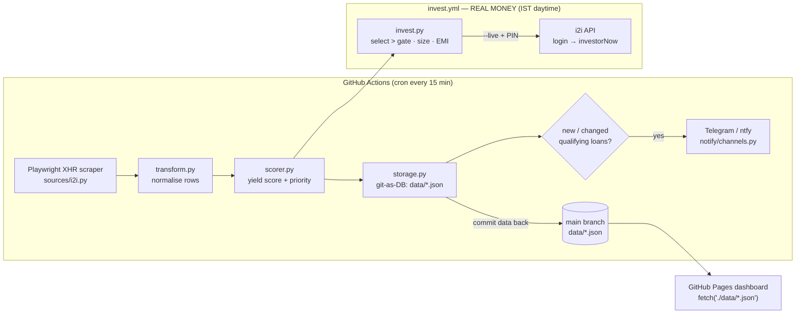

# i2i-yield-watch

> Automated i2iFunding high-yield P2P loan intelligence — scrape, score, notify, and (optionally) auto-invest.

[](LICENSE)
[](https://github.com/chirag127/i2i-yield-watch/stargazers)
[](https://github.com/chirag127/i2i-yield-watch/commits)
[](https://www.python.org/)
[](https://github.com/chirag127/i2i-yield-watch/actions/workflows/scrape.yml)

**What it is.** A hands-off watcher for the [i2iFunding](https://www.i2ifunding.com/) P2P lending marketplace. Every 15 minutes it scrapes the public borrower listing, scores each loan by yield/credit/priority, and alerts Telegram on newly-qualifying loans. State lives entirely in committed JSON files (git-as-DB) — no external database. An optional **real-money auto-investor** can place and reverse investments, gated safe-off by default.

- **Live dashboard:** https://chirag127.github.io/i2i-yield-watch/
- **GHP landing:** https://chirag127.github.io/i2i-yield-watch/
- **Repo:** https://github.com/chirag127/i2i-yield-watch

⭐ **If this is useful, please star the repo — it helps others find it.**

> **⚠️ Real-money capable.** The auto-investor places actual money on i2iFunding. It ships **safe-gated**: dry-run by default (`invest` prints the plan and places nothing), and `AUTOINVEST_MIN_RATE_PCT=100` places money only on loans with rate **strictly > 100%**. Real placement needs `--live` **and** `I2I_TXN_PIN`; any mid-run error stops all further spending. Lower the gate deliberately, at your own risk.

> **🔒 No PII here.** This public repo holds tooling and anonymised aggregate stats only (avg rate, counts). Borrower names, PAN, CIBIL, escrow, and account records live in a **separate private** repo — never committed here.

## Architecture at a glance



*General information, not investment advice.*

---

## How it works

### Scraper (Playwright XHR interception)

Direct HTTP calls to `api.i2ifunding.com` are blocked (502). The i2iFunding Angular SPA fires its own `getActiveFilteredBorrowers` XHR on page load, which succeeds from a real browser context. `page.evaluate(fetch)` is CORS-blocked. The scraper:

1. Attaches a `page.on("response", ...)` listener **before** navigation.
2. `page.goto(TARGET_URL)` — Angular fires `getActiveFilteredBorrowers` XHR, listener captures it.
3. Waits 8 s for the initial batch (page 1, ~10 rows).
4. Clicks "Show More" in a loop until the row count stabilises — captures each additional XHR page.
5. Returns deduplicated rows keyed by `pl_bloan_id`.

Whole-session retry up to 3× with backoff.

### Storage — git-as-DB (JSON)

State is stored as JSON files in `data/`, committed back to `main` after every CI run. **No external database required.** Firebase/Firestore was removed — the free tier 429'd under the 2× self-loop cadence.

| File | Contents |
|------|----------|
| `data/active-loans.json` | Current active loan list (array) |
| `data/notify-state.json` | Last notified qualifying-loan set + timestamp |
| `data/stats.json` | Aggregate counters (avgRate, highPriorityCount, …) |
| `data/runs.json` | Last 200 run summaries |
| `data/notifications-sent.json` | All-time notified loan IDs (dedup) |
| `data/archive/index.json` | `{files:[{month, count, lastArchivedAt}]}` |
| `data/archive/YYYY-MM.json` | Archived loans for that month |

Set `I2I_STORAGE=firebase` to re-enable Firestore (requires `FIREBASE_SA_JSON` secret). Default and recommended: `json`.

### Notifications

Single Telegram bot `oriz127_bot`. Notify logic:

- **NEW loans only** — a loan is announced once, the first time it appears AND its rate exceeds `NOTIFY_MIN_RATE_PCT` (default 40%). Loan IDs are persisted in `data/notify-state.json`; the set never re-notifies an already-seen ID.
- **LOUD tier** — any loan with rate **> `NOTIFY_HIGH_RATE_PCT`** (default 100) fires an immediate loud alert the moment it appears (or crosses the threshold), independent of the standard change-only tier — so a fresh >100% auto-invest candidate never goes unnoticed.
- **Qualifying-set change** — if the set of loans above the threshold changes (any loan added or dropped), a summary fires.
- **Periodic digest** — if `I2I_DIGEST_HOURS` is set, a full digest fires that often regardless of change.
- `--reset-notify-state` flag (or the `reset_notify_state` workflow_dispatch input) clears the dedup state so all currently-qualifying loans re-announce once.

### Dashboard

Static GitHub Pages site at `chirag127.github.io/i2i-yield-watch`. Reads the committed JSON files via plain `fetch('./data/...')` — no Firebase SDK, no browser Firestore. Updated on every successful CI run (deploy job pulls latest `main` after scrape commits data back).

Features: Active / Archived tabs, month pills, rate/priority/credit/product filters, search, sort, pagination, 4 charts, keyboard shortcuts (`/` search, `←→` page, `R` reset, `1/2` tabs, `F` filter toggle), dark/light theme.

### Telegram command bot (`telegram-bot.yml`)

Message the same bot to **re-trigger workflows on demand** — no need to wait for the next cron:

| Command | What it does |
|---|---|
| `/start`, `/help` | shows the command list |
| `/invest` | runs the REAL-MONEY auto-invest immediately (both accounts) |
| `/scrape` | forces a fresh market scrape + notifications |
| `/wallet` | checks investable escrow balance (all accounts) |
| `/digest` | sends the portfolio digest |
| `/emireport` | refreshes the EMI-status snapshot |
| `/status` | replies with the latest dashboard stats (no dispatch) |
| `/ping` | liveness check |

Every command also appears in the **slash menu** — type `/` in the chat (or tap the *Menu* button next to the input field) and Telegram shows all commands with their descriptions. The menu is registered automatically by the bot job via `setMyCommands` on every run.

#### Setup (one-time)

1. **Create the bot** — in Telegram, message `@BotFather` → `/newbot` → pick a name and username (e.g. `i2i_yield_bot`). BotFather replies with a `123456:ABC-DEF...` **token**. You can also run `/setdescription` and `/setabouttext` there to polish the bot's profile.
2. **Get your chat id** — message your new bot anything (e.g. `/start`), then visit `https://api.telegram.org/bot<TOKEN>/getUpdates` in a browser; the `chat.id` in the JSON is your `TELEGRAM_CHAT_ID`. (A simpler path: message `@userinfobot` and read the id it replies with.)
3. **Store the secrets** on GitHub:
   ```bash
   gh secret set TELEGRAM_BOT_TOKEN --repo chirag127/i2i-yield-watch
   gh secret set TELEGRAM_CHAT_ID    --repo chirag127/i2i-yield-watch
   ```
4. **Wait for the next `telegram-bot.yml` run (≤5 min) or dispatch it once:**
   ```bash
   gh workflow run "i2i Telegram Command Bot" --repo chirag127/i2i-yield-watch
   ```
   The run registers the command menu and starts long-polling. Now send `/invest` from *your* chat and the bot replies with the dispatch link within ~a minute.

**Security:** only the chat whose id equals `TELEGRAM_CHAT_ID` can trigger real-money workflows — anyone else's messages are read and ignored (the offset is still advanced, so foreign messages don't block yours). To add a second phone, put both chat ids in the secret, comma-separated.

**How it stays alive (continuously):** the bot job has no cron of its own — it runs **continuously** inside one long-lived job (350-min timeout) and long-polls `getUpdates` forever (`--iterations 0`). Because long-poll returns the instant a message is waiting, a command is answered in **~1–3 s** while a job is alive — no more waiting for a 5-min cron window. Two mechanisms keep it alive:

1. **Self-handoff** — ~10 min before the job timeout, the job dispatches a successor bot run and exits; the `telegram-bot` concurrency group queues the successor, so the handoff gap is seconds. A companion loop commits `data/telegram-bot-state.json` (the `getUpdates` offset) to git every 60 s, so even a job killed by timeout never re-processes old messages.
2. **Tick pinger (`tick.yml`)** — the crash-recovery net: it checks every 5 min (GitHub's cron floor) whether a bot run is alive and dispatches one only if not. A dead bot is restarted within ~5 min; a healthy bot is never double-run. An external cron pinger (`scripts/dispatch_tick.sh`, `repository_dispatch` type `tick`) can fire it too — a tick while the bot is alive is a harmless no-op.

Dispatching uses `GITHUB_TOKEN` with `actions: write` (per GitHub docs, `workflow_dispatch` triggered by `GITHUB_TOKEN` *does* create a run).

### CI — GitHub Actions (`scrape.yml`)

- **Cron:** `3,18,33,48 * * * *` (every 15 min, UTC). GitHub honors 15-min intervals reliably.
- **Self-loop:** each cron fires `--iterations 6 --interval 120` — ~2-min effective polling inside the 15-min window (`POLL_INTERVAL_S` / `POLL_ITERATIONS` are workflow vars, tune without editing cron). 6×120s=12 min + ~2 min setup fits the window, so runs never overlap and queued runs are never cancelled.
- **Concurrency:** `group: scraper`, `cancel-in-progress: false` — queued, never skipped.
- **Data commit:** stages only the scraper-owned files (`data/active-loans.json`, `notify-*.json`, `stats.json`, `runs.json`, `archive/`), restores the git-crypt-decrypted `.env`/SA blob, then `fetch + rebase + push` with a retry loop — **the job fails loudly if the data commit is not pushed**, so a green run always means fresh data reached `main` (no more silent stale dashboard).
- **Deploy:** after scrape succeeds, build `_site/` (dashboard HTML/JS/CSS + `data/`), upload as Pages artifact, deploy.
- **Failure alert:** `if: failure()` step pings Telegram with the run's start time + failing step, so a stale alert from an old failed run can never be mistaken for a live one.

### Auto-investor (`invest.py` / `cancel.py`) — REAL MONEY

Places (and reverses) investments via **direct HTTP** to the i2i API with **auto-login** for fresh tokens each run. The loan *listing* still comes from the Playwright scraper (the one endpoint that reliably blocks direct HTTP); login + `walletAndFund` + `loandetailtoinvest` + `investorNow` + `cancel/funding` are plain `urllib` calls carrying browser-parity headers (Origin/Referer/UA). If a money POST 502s/403s even so, that one call retries inside a Playwright browser context (fallback).

Modular split: `config.py` (all tunables), `auth.py` (AES login), `client.py` (all HTTP, one place), `invest.py` (pure select/rank/size/EMI + orchestrator), `cancel.py` (thin).

- **Login:** POST `.../login/` with `usr_password` AES-encrypted exactly as the SPA does (CryptoJS `AES.encrypt(pw, "kXyb3gzU")`; passphrase lifted from i2i's `main.js`, proven by decrypting a captured login blob). Fresh `session_id` + `csrf_token` every run — token expiry is a non-issue. **Auth chain:** auto-login is the primary path; `I2I_CSRF_TOKEN` + `I2I_SESSION_ID` (captured from a HAR) are used only as a fallback if login fails or no creds are set — session tokens expire, so they must never be the primary auth.
- **Select + rank:** loans with rate **strictly > `AUTOINVEST_MIN_RATE_PCT`** (default **100**) **AND** credit score **>= 700** (centralized in `src/i2i_watch/config.py` — a missing credit score is imputed 720 and *passes* the gate; never treated as 0), ranked rate desc then `bloan_cibil_score` desc.
- **Size:** `min(PER_LOAN_CAP, amtLeft, wallet)`, floored to `invest_multiple_value` and whole rupees, skipped if `< INVEST_MIN_AMOUNT`. A run keeps going down the ranked list until the wallet is exhausted (no per-run cap).
- **Dry-run default** — prints the plan, places nothing. `--live` places for real (requires `I2I_TXN_PIN`). Any error mid-run STOPS.

```bash
python -m i2i_watch invest                    # DRY RUN — plan only (default account)
python -m i2i_watch invest --account neeru    # DRY RUN for the neeru account
python -m i2i_watch invest --live             # REAL money (default account)
python -m i2i_watch cancel <loanId>…          # DRY RUN of cancel
python -m i2i_watch cancel <loanId> --live    # reverse funding(s)
python -m i2i_watch wallet --account chirag   # real investable escrow balance
python -m i2i_watch config                    # EFFECTIVE gates (env -> account -> default)
python -m i2i_watch digest                    # portfolio summary to Telegram (silent)
```

**Near-miss visibility** — when a run finds nothing to invest, it also reports
loans that passed the RATE gate but failed the CREDIT gate (money-left-on-the-
table), so you can see *why* a hot loan wasn't auto-invested.

**Idle-capital watchdog** — after `IDLE_WATCHDOG_DAYS` (default 3) with no
qualifying loan, the auto-investor sends a silent Telegram nudge so idle escrow
never goes unmonitored. State lives in `data/invest-idle.json` (committed by
invest.yml).

**Multi-account portfolio** (`accounts.py`): the platform caps ~₹5,000 per loan per
investor, so the portfolio runs one account per i2i login — each with its OWN
auth, rate gate and `data/invested-loans-<acct>.json` dedup namespace. The default
account (`chirag`) keeps the legacy unprefixed env names; every secondary account
uses `I2I_<ACCOUNT>_*` (e.g. `I2I_NEERU_EMAIL`, `I2I_NEERU_PASSWORD`,
`I2I_NEERU_TXN_PIN`, `I2I_NEERU_AUTOINVEST_MIN_RATE_PCT`). Select the account with
`--account <name>` or `I2I_ACCOUNT=<name>`; declare the whole portfolio with
`I2I_ACCOUNTS=chirag,neeru`. Adding a third account = add its name + env vars +
a row in the `invest.yml` matrix.

CI: `.github/workflows/invest.yml` runs **two sequential jobs in the IST daytime
window — chirag always first** (`invest-chirag` places and commits, then
`invest-neeru` starts via `needs:` and fills what's left), so the primary account
gets first pick of every qualifying loan. Both accounts gate at **>100%**
(chirag >100%, neeru >100%), credit score **>= 700**. Requires per-account secrets
`I2I_EMAIL`/`I2I_PASSWORD`/`I2I_TXN_PIN` (chirag) and `I2I_NEERU_*` (neeru) +
`TELEGRAM_*` for the summary; CSRF/SESSION tokens are optional fallback auth
(refresh from a HAR when login is unavailable).

---

## Environment variables

| Variable | Default | Description |
|----------|---------|-------------|
| `I2I_STORAGE` | `json` | `json` (git-as-DB) or `firebase` (Firestore) |
| `NOTIFY_MIN_RATE_PCT` | `40` | **Notify gate** — Telegram alert on loans with rate **>** this |
| `NOTIFY_HIGH_RATE_PCT` | `100` | **LOUD alert gate** — fires the moment a loan exceeds this (auto-invest candidate), even if the standard set is unchanged |
| `I2I_DIGEST_HOURS` | unset | Re-send the qualifying set every N hours even when unchanged (so a stable market never goes silent) |
| `AUTOINVEST_MIN_RATE_PCT` | `100` | **Auto-invest gate** — place real money only on rate **>** this |
| `AUTOINVEST_MIN_CREDIT_SCORE` | `700` in `src/i2i_watch/config.py` | **Centralized credit gate** — skip loans with score **<700** (no-score loans are imputed 720 and pass); not a workflow/account override |
| `IDLE_WATCHDOG_DAYS` | `3` | After this many days with no qualifying loan, send a silent Telegram nudge |
| `IDLE_WATCHDOG_LOUD` | `false` | Make the idle nudge a loud (buzzing) alert |
| `WALLET_ALERT_THRESHOLD` | `10000` | Below this Rs investable escrow, the wallet-check ping becomes a LOUD alert |
| `PER_LOAN_CAP` | `5000` | Max ₹ placed in one loan |
| `INVEST_MIN_AMOUNT` | `1000` | Min ₹ per investment (skip below) |
| `I2I_EMAIL` / `I2I_PASSWORD` | — | Login creds (password AES-encrypted client-side) — **primary** auth (default account) |
| `I2I_CSRF_TOKEN` / `I2I_SESSION_ID` | — | Session-token **fallback** auth (used only if login fails / no creds; expires) |
| `I2I_TXN_PIN` | — | Transaction PIN required to place/cancel (`--live`) |
| `I2I_ACCOUNTS` | `chirag` | Comma-separated portfolio account names |
| `I2I_ACCOUNT` | first in `I2I_ACCOUNTS` | Account for this run (`--account` overrides) |
| `I2I_NEERU_*` | — | Secondary-account envs: `I2I_NEERU_EMAIL`, `I2I_NEERU_PASSWORD`, `I2I_NEERU_TXN_PIN`, `I2I_NEERU_AUTOINVEST_MIN_RATE_PCT` (default 100), the centralized credit gate from `src/i2i_watch/config.py`… |
| `PRIORITY_HIGH_RATE_PCT` | `70` | Rate threshold for VERY_HIGH priority LABEL (display only) |
| `PRIORITY_MEDIUM_RATE_PCT` | `50` | Rate threshold for MEDIUM priority LABEL (display only) |
| `LISTING_MIN_ROWS` | `1` | Refuse to overwrite state when a scrape returns fewer rows; protects against empty/outage responses |

| `TELEGRAM_ENABLED` | `false` | Enable Telegram notifications |
| `TELEGRAM_BOT_TOKEN` | — | Bot token for `oriz127_bot` |
| `TELEGRAM_CHAT_ID` | — | Target chat/channel ID |
| `NTFY_ENABLED` | `false` | Enable ntfy.sh notifications |
| `NTFY_BASE_URL` | — | ntfy server URL |
| `NTFY_TOPIC` | — | ntfy topic |
| `NTFY_USER` / `NTFY_PASSWORD` | — | ntfy credentials |
| `DASHBOARD_URL` | — | URL included in Telegram alerts |
| `STARTUP_JITTER_MS` | `2000` | Random delay on startup to stagger parallel runs |

---

## Local setup

```bash
pip install -e ".[browser,dev]"
playwright install chromium

# single run, verbose
python -m i2i_watch --iterations 1 -v

# run tests
pytest -q
```

On Windows use `py` launcher: `py -m i2i_watch --iterations 1 -v`.

---

## Architecture

```
src/i2i_watch/
  sources/i2i.py     Direct-HTTP listing (Playwright browser fallback)
  transform.py       Raw rows → normalised loan dicts
  scorer.py          Yield score + priority labels
  storage.py         JSON (git-as-DB) + optional Firestore
  pipeline.py        Orchestrates scrape → transform → score → store → notify
  accounts.py        Multi-account portfolio (chirag default, neeru secondary)
  client.py          All i2i HTTP (login, wallet, invest, cancel, top-up)
  invest.py          Pure select/rank/size/EMI + orchestrator
  cancel.py          Reverse fundings
  topup.py           Escrow top-up (UPI/Paytm checkout)
  notify/
    channels.py      Telegram + ntfy senders
  __main__.py        CLI entry point (invest/cancel/wallet/config/digest)

dashboard/
  index.html         Single-page app shell
  app.js             Vanilla JS — fetches data/*.json, no Firebase
  styles.css         Dark/light theme, bespoke design

data/                git-as-DB state (committed by CI)
  active-loans.json
  invested-loans.json        placed loanIds (default account, dedup)
  invested-loans-neeru.json  placed loanIds (neeru, dedup)
  invest-idle.json           idle-watchdog last-qualified timestamp
  stats.json
  notify-state.json
  notifications-sent.json
  runs.json
  archive/

.github/workflows/scrape.yml        Cron + self-loop + commit-data-back + deploy
.github/workflows/invest.yml        REAL-MONEY auto-invest (chirag then neeru)
.github/workflows/wallet-check.yml  Daily investable-escrow Telegram ping
.github/workflows/digest.yml        Weekly portfolio summary to Telegram

scripts/dispatch_tick.sh            Fire a repository_dispatch tick (cron pinger)
```

## Reliability: external cron pinger (optional)

GitHub's free-tier cron is best-effort — ticks can arrive late or be skipped
under load (observed ~30-40 min effective even with a 15-min schedule).
`scrape.yml` already listens for a `repository_dispatch` event of type `tick`,
so you can get TRUE sub-15-min polling from a free external pinger:

1. Create a fine-grained PAT (`repo` → `actions: write`) and store it as the
   `I2I_DISPATCH_TOKEN` secret.
2. On [cron-job.org](https://cron-job.org) (or healthchecks.io), make a job
   every 5 minutes that POSTs (or point it at `scripts/dispatch_tick.sh`):
   ```bash
   curl -X POST https://api.github.com/repos/chirag127/i2i-yield-watch/dispatches \
     -H "Authorization: Bearer $I2I_DISPATCH_TOKEN" \
     -H "Accept: application/vnd.github+json" \
     -d '{"event_type":"tick"}'
   ```
   Each ping fires a scrape run; the self-loop + per-run dedup make it
   idempotent, so a late/duplicate ping is harmless. `scripts/dispatch_tick.sh`
   wraps this exact call (reads `I2I_DISPATCH_TOKEN`).

---

## Part of the oriz family

One of ~80 sites and tools under the **oriz** umbrella — see the hub at [blog.oriz.in](https://blog.oriz.in). Hosting is **$0**: the scraper and auto-investor run on GitHub Actions' free minutes, state is git-as-DB, and the dashboard is served free from GitHub Pages.

## Security

No secrets in the repo. `.env` and the Firebase service-account JSON are **git-crypt encrypted** at rest (CI unlocks via the `GIT_CRYPT_KEY` secret); credentials (`I2I_*`, `TELEGRAM_*`, `NTFY_*`) are GitHub Actions secrets, never committed. No borrower PII lives here — see the note at the top.

## Contributing

Issues and PRs welcome. Conventional commits are the changelog. Keep the public/private PII boundary intact — never add borrower data to this repo.

## Status

Stable and running in production (15-min scrape cron + optional hourly invest window).

## Disclaimer

General information and personal automation only — **not investment advice**. P2P lending carries real risk of capital loss; the auto-investor can place real money. Use at your own risk.

## License

MIT — see [LICENSE](LICENSE). Author: **Chirag Singhal** · chirag@oriz.in
