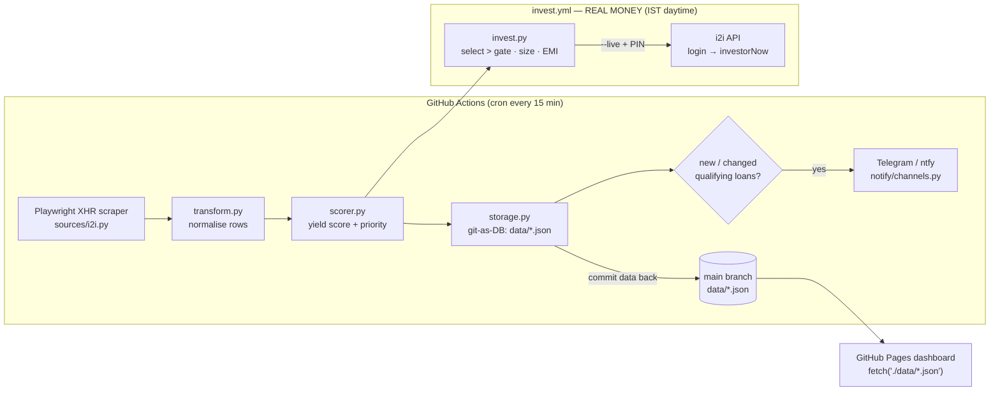

# i2i-yield-watch

> Automated i2iFunding high-yield P2P loan intelligence — scrape, score, notify, and (optionally) auto-invest.

[](LICENSE)
[](https://github.com/chirag127/i2i-yield-watch/stargazers)
[](https://github.com/chirag127/i2i-yield-watch/commits)
[](https://www.python.org/)
[](https://github.com/chirag127/i2i-yield-watch/actions/workflows/scrape.yml)

**What it is.** A hands-off watcher for the [i2iFunding](https://www.i2ifunding.com/) P2P lending marketplace. Every 15 minutes it scrapes the public borrower listing, scores each loan by yield/credit/priority, and alerts Telegram on newly-qualifying loans. State lives entirely in committed JSON files (git-as-DB) — no external database. An optional **real-money auto-investor** can place and reverse investments, gated safe-off by default.

- **Live dashboard:** https://chirag127.github.io/i2i-yield-watch/
- **GHP landing:** https://chirag127.github.io/i2i-yield-watch/
- **Repo:** https://github.com/chirag127/i2i-yield-watch

⭐ **If this is useful, please star the repo — it helps others find it.**

> **⚠️ Real-money capable.** The auto-investor places actual money on i2iFunding. It ships **safe-gated**: dry-run by default (`invest` prints the plan and places nothing), and `AUTOINVEST_MIN_RATE_PCT=100` places money only on loans with rate **strictly > 100%**. Real placement needs `--live` **and** `I2I_TXN_PIN`; any mid-run error stops all further spending. Lower the gate deliberately, at your own risk.

> **🔒 No PII here.** This public repo holds tooling and anonymised aggregate stats only (avg rate, counts). Borrower names, PAN, CIBIL, escrow, and account records live in a **separate private** repo — never committed here.

## Architecture at a glance



*General information, not investment advice.*

---

## How it works

### Scraper (Playwright XHR interception)

Direct HTTP calls to `api.i2ifunding.com` are blocked (502). The i2iFunding Angular SPA fires its own `getActiveFilteredBorrowers` XHR on page load, which succeeds from a real browser context. `page.evaluate(fetch)` is CORS-blocked. The scraper:

1. Attaches a `page.on("response", ...)` listener **before** navigation.
2. `page.goto(TARGET_URL)` — Angular fires `getActiveFilteredBorrowers` XHR, listener captures it.
3. Waits 8 s for the initial batch (page 1, ~10 rows).
4. Clicks "Show More" in a loop until the row count stabilises — captures each additional XHR page.
5. Returns deduplicated rows keyed by `pl_bloan_id`.

Whole-session retry up to 3× with backoff.

### Storage — git-as-DB (JSON)

State is stored as JSON files in `data/`, committed back to `main` after every CI run. **No external database required.** Firebase/Firestore was removed — the free tier 429'd under the 2× self-loop cadence.

| File | Contents |
|------|----------|
| `data/active-loans.json` | Current active loan list (array) |
| `data/notify-state.json` | Last notified qualifying-loan set + timestamp |
| `data/stats.json` | Aggregate counters (avgRate, highPriorityCount, …) |
| `data/runs.json` | Last 200 run summaries |
| `data/notifications-sent.json` | All-time notified loan IDs (dedup) |
| `data/archive/index.json` | `{files:[{month, count, lastArchivedAt}]}` |
| `data/archive/YYYY-MM.json` | Archived loans for that month |

Set `I2I_STORAGE=firebase` to re-enable Firestore (requires `FIREBASE_SA_JSON` secret). Default and recommended: `json`.

### Notifications

Single Telegram bot `oriz127_bot`. Notify logic:

- **NEW loans only** — a loan is announced once, the first time it appears AND its rate exceeds `NOTIFY_MIN_RATE_PCT` (default 40%). Loan IDs are persisted in `data/notify-state.json`; the set never re-notifies an already-seen ID.
- **Qualifying-set change** — if the set of loans above the threshold changes (any loan added or dropped), a summary fires.
- **Periodic digest** — if `I2I_DIGEST_HOURS` is set, a full digest fires that often regardless of change.
- `--reset-notify-state` flag (or the `reset_notify_state` workflow_dispatch input) clears the dedup state so all currently-qualifying loans re-announce once.

### Dashboard

Static GitHub Pages site at `chirag127.github.io/i2i-yield-watch`. Reads the committed JSON files via plain `fetch('./data/...')` — no Firebase SDK, no browser Firestore. Updated on every successful CI run (deploy job pulls latest `main` after scrape commits data back).

Features: Active / Archived tabs, month pills, rate/priority/credit/product filters, search, sort, pagination, 4 charts, keyboard shortcuts (`/` search, `←→` page, `R` reset, `1/2` tabs, `F` filter toggle), dark/light theme.

### CI — GitHub Actions (`scrape.yml`)

- **Cron:** `3,18,33,48 * * * *` (every 15 min, UTC). GitHub honors 15-min intervals reliably.
- **Self-loop:** each cron fires `--iterations 2 --interval 90` — 2 scrapes ~90 s apart to approximate 5-min cadence.
- **Concurrency:** `group: scraper`, `cancel-in-progress: false` — queued, never skipped.
- **Data commit:** `git add data && git commit && git pull --rebase --autostash origin main && git push` after each run. Rebase guard prevents split-brain.
- **Deploy:** after scrape succeeds, build `_site/` (dashboard HTML/JS/CSS + `data/`), upload as Pages artifact, deploy.
- **Failure alert:** `if: failure()` step pings Telegram.

### Auto-investor (`invest.py` / `cancel.py`) — REAL MONEY

Places (and reverses) investments via **direct HTTP** to the i2i API with **auto-login** for fresh tokens each run. The loan *listing* still comes from the Playwright scraper (the one endpoint that reliably blocks direct HTTP); login + `walletAndFund` + `loandetailtoinvest` + `investorNow` + `cancel/funding` are plain `urllib` calls carrying browser-parity headers (Origin/Referer/UA). If a money POST 502s/403s even so, that one call retries inside a Playwright browser context (fallback).

Modular split: `config.py` (all tunables), `auth.py` (AES login), `client.py` (all HTTP, one place), `invest.py` (pure select/rank/size/EMI + orchestrator), `cancel.py` (thin).

- **Login:** POST `.../login/` with `usr_password` AES-encrypted exactly as the SPA does (CryptoJS `AES.encrypt(pw, "kXyb3gzU")`; passphrase lifted from i2i's `main.js`, proven by decrypting a captured login blob). Fresh `session_id` + `csrf_token` every run — token expiry is a non-issue. **Auth chain:** auto-login is the primary path; `I2I_CSRF_TOKEN` + `I2I_SESSION_ID` (captured from a HAR) are used only as a fallback if login fails or no creds are set — session tokens expire, so they must never be the primary auth.
- **Select + rank:** loans with rate **strictly > `AUTOINVEST_MIN_RATE_PCT`** (default **100**), ranked rate desc then `bloan_cibil_score` desc.
- **Size:** `min(PER_LOAN_CAP, amtLeft, wallet)`, floored to `invest_multiple_value` and whole rupees, skipped if `< INVEST_MIN_AMOUNT`. A run keeps going down the ranked list until the wallet is exhausted (no per-run cap).
- **Dry-run default** — prints the plan, places nothing. `--live` places for real (requires `I2I_TXN_PIN`). Any error mid-run STOPS.

```bash
python -m i2i_watch invest                    # DRY RUN — plan only (default account)
python -m i2i_watch invest --account neeru    # DRY RUN for the neeru account
python -m i2i_watch invest --live             # REAL money (default account)
python -m i2i_watch cancel <loanId>…          # DRY RUN of cancel
python -m i2i_watch cancel <loanId> --live    # reverse funding(s)
```

**Multi-account portfolio** (`accounts.py`): the platform caps ~₹5,000 per loan per
investor, so the portfolio runs one account per i2i login — each with its OWN
auth, rate gate and `data/invested-loans-<acct>.json` dedup namespace. The default
account (`chirag`) keeps the legacy unprefixed env names; every secondary account
uses `I2I_<ACCOUNT>_*` (e.g. `I2I_NEERU_EMAIL`, `I2I_NEERU_PASSWORD`,
`I2I_NEERU_TXN_PIN`, `I2I_NEERU_AUTOINVEST_MIN_RATE_PCT`). Select the account with
`--account <name>` or `I2I_ACCOUNT=<name>`; declare the whole portfolio with
`I2I_ACCOUNTS=chirag,neeru`. Adding a third account = add its name + env vars +
a row in the `invest.yml` matrix.

CI: `.github/workflows/invest.yml` runs a **matrix** — one `invest --live` job per
account (chirag >100%, neeru >150%) in the IST daytime window. Requires per-account
secrets `I2I_EMAIL`/`I2I_PASSWORD`/`I2I_TXN_PIN` (chirag) and `I2I_NEERU_*`
(neeru) + `TELEGRAM_*` for the summary; CSRF/SESSION tokens are optional fallback
auth (refresh from a HAR when login is unavailable).

---

## Environment variables

| Variable | Default | Description |
|----------|---------|-------------|
| `I2I_STORAGE` | `json` | `json` (git-as-DB) or `firebase` (Firestore) |
| `NOTIFY_MIN_RATE_PCT` | `40` | **Notify gate** — alert on loans with rate **>** this |
| `AUTOINVEST_MIN_RATE_PCT` | `100` | **Auto-invest gate** — place real money only on rate **>** this |
| `PER_LOAN_CAP` | `5000` | Max ₹ placed in one loan |
| `INVEST_MIN_AMOUNT` | `1000` | Min ₹ per investment (skip below) |
| `I2I_EMAIL` / `I2I_PASSWORD` | — | Login creds (password AES-encrypted client-side) |
| `I2I_TXN_PIN` | — | Transaction PIN required to place/cancel (`--live`) |
| `PRIORITY_HIGH_RATE_PCT` | `70` | Rate threshold for VERY_HIGH priority LABEL (display only) |
| `PRIORITY_MEDIUM_RATE_PCT` | `50` | Rate threshold for MEDIUM priority LABEL (display only) |
| `I2I_DIGEST_HOURS` | unset | Send full digest every N hours regardless of change |
| `TELEGRAM_ENABLED` | `false` | Enable Telegram notifications |
| `TELEGRAM_BOT_TOKEN` | — | Bot token for `oriz127_bot` |
| `TELEGRAM_CHAT_ID` | — | Target chat/channel ID |
| `NTFY_ENABLED` | `false` | Enable ntfy.sh notifications |
| `NTFY_BASE_URL` | — | ntfy server URL |
| `NTFY_TOPIC` | — | ntfy topic |
| `NTFY_USER` / `NTFY_PASSWORD` | — | ntfy credentials |
| `DASHBOARD_URL` | — | URL included in Telegram alerts |
| `STARTUP_JITTER_MS` | `0` | Random delay on startup to stagger parallel runs |

---

## Local setup

```bash
pip install -e ".[browser,dev]"
playwright install chromium

# single run, verbose
python -m i2i_watch --iterations 1 -v

# run tests
pytest -q
```

On Windows use `py` launcher: `py -m i2i_watch --iterations 1 -v`.

---

## Architecture

```
src/i2i_watch/
  sources/i2i.py     Playwright XHR scraper
  transform.py       Raw rows → normalised loan dicts
  scorer.py          Yield score + priority labels
  storage.py         JSON (git-as-DB) + optional Firestore
  pipeline.py        Orchestrates scrape → transform → score → store → notify
  notify/
    telegram.py      Telegram bot sender
    ntfy.py          ntfy.sh sender
    formatter.py     Compact loan block formatter
  __main__.py        CLI entry point (--iterations, --interval, -v, --reset-notify-state)

dashboard/
  index.html         Single-page app shell
  app.js             Vanilla JS — fetches data/*.json, no Firebase
  styles.css         Dark/light theme, bespoke design

data/                git-as-DB state (committed by CI)
  active-loans.json
  stats.json
  notify-state.json
  notifications-sent.json
  runs.json
  archive/

.github/workflows/scrape.yml   Cron + self-loop + commit-data-back + deploy
```

---

## Part of the oriz family

One of ~80 sites and tools under the **oriz** umbrella — see the hub at [blog.oriz.in](https://blog.oriz.in). Hosting is **$0**: the scraper and auto-investor run on GitHub Actions' free minutes, state is git-as-DB, and the dashboard is served free from GitHub Pages.

## Security

No secrets in the repo. `.env` and the Firebase service-account JSON are **git-crypt encrypted** at rest (CI unlocks via the `GIT_CRYPT_KEY` secret); credentials (`I2I_*`, `TELEGRAM_*`, `NTFY_*`) are GitHub Actions secrets, never committed. No borrower PII lives here — see the note at the top.

## Contributing

Issues and PRs welcome. Conventional commits are the changelog. Keep the public/private PII boundary intact — never add borrower data to this repo.

## Status

Stable and running in production (15-min scrape cron + optional hourly invest window).

## Disclaimer

General information and personal automation only — **not investment advice**. P2P lending carries real risk of capital loss; the auto-investor can place real money. Use at your own risk.

## License

MIT — see [LICENSE](LICENSE). Author: **Chirag Singhal** · chirag@oriz.in
